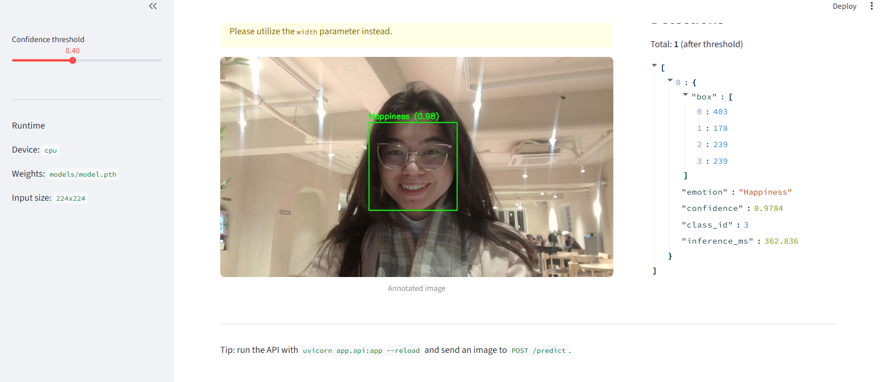

# Facial Expression Recognition  
**Real-Time Emotion Intelligence System**
A production-oriented project for **facial expression recognition**, supporting **real-time inference**, **API deployment**, and **interactive demos**.


.

---

## ✨ Highlights
- Deep learning–based emotion recognition model
- Modular, clean codebase
- Real-time inference support
- API + UI demo
- Pretrained weights available

---

## 🎥 Demo

**Live / video-based**


**Sample prediction**

<p align="left">
  
</p>

---

## 🧠 Model
This project uses:
- face detection for region extraction  
- a CNN-based emotion classifier  
- lightweight design for real-time performance  

Core inference logic is implemented in `src/`.

---

## 📂 Project Structure
```

FACIAL_EXPRESSION_RECOGNITION/
├── app/              # API and UI entry points
├── src/              # Core model and inference logic
├── config/           # Configuration files
├── scripts/          # Utility scripts
├── tests/            # Tests
├── requirements.txt
└── README.md

````

---

## ⚙️ Setup

```bash
git clone <repo-url>
cd FACIAL_EXPRESSION_RECOGNITION
pip install -r requirements.txt
pip install -e .
````

---

## ▶️ Usage

Run real-time demo:

```bash
streamlit run app/ui.py
```

Run API server:

```bash
uvicorn app.api:app --reload
```

---

## 📦 Pretrained Models

Pretrained weights are hosted on **Hugging Face**.

After downloading:

```
models/
 └── model.pth
```

---

## 🚀 Applications

* Facial emotion recognition
* Human–computer interaction
* Affective computing
* Emotion-aware AI systems

---

## 🛠️ Tech Stack

Python · PyTorch · OpenCV · FastAPI · Streamlit

---

## 👩‍💻 Author

**Diyora Bobokulova**
AI Automation & Computer Vision

GitHub: [https://github.com/imdiora](https://github.com/imdiora)
Hugging Face: [https://huggingface.co/imdiora](https://huggingface.co/imdiora)

Acknowledgement: Thanks to [Tales Alves](https://github.com/talesreisalves) for major support with implementation and inspiration.
